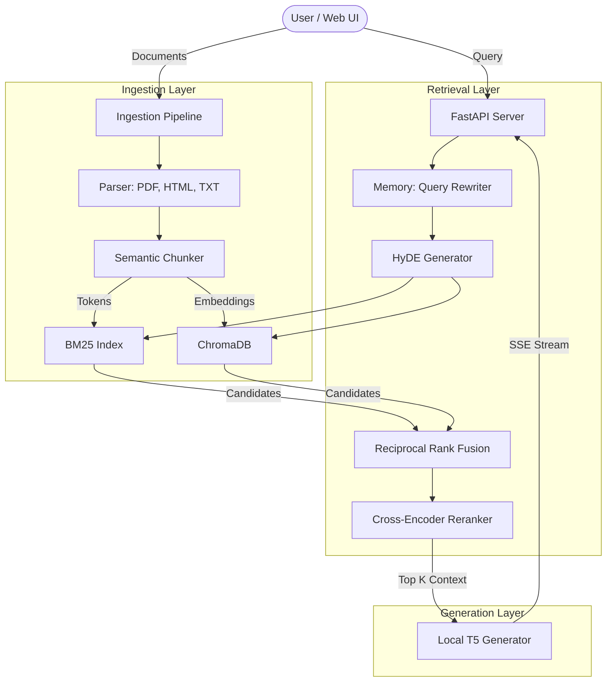

# 🚀 Advanced Production RAG 


A fully stateless-to-stateful, enterprise-grade **Retrieval-Augmented Generation (RAG)** system built completely from scratch in Python. 

**Zero LangChain. Zero LlamaIndex. Zero External API Keys.**

This project demonstrates how to build the core orchestration layers of an advanced AI retrieval and generation engine using raw Python, NumPy, ChromaDB, and local HuggingFace models, culminating in a beautiful, streaming Vanilla HTML/JS frontend.

---

## ✨ Enterprise Features

- **100% Local & Private**: Runs entirely on your machine using lightweight local models (`all-MiniLM-L6-v2`, `ms-marco-MiniLM-L-6-v2`, `flan-t5-small`).
- **Hybrid Search Engine**: Custom-built TF-IDF/BM25 sparse retrieval combined with Dense Vector retrieval via ChromaDB.
- **Reciprocal Rank Fusion (RRF)**: Mathematically merges sparse and dense retrieval candidate lists for superior recall.
- **Cross-Encoder Re-Ranking**: Ranks the fused candidates using an absolute contextual relevance score.
- **HyDE (Hypothetical Document Embeddings)**: Uses the local T5 model to generate a hypothetical "perfect" document to drastically improve vector similarity matching before executing the search.
- **Conversation Memory**: Tracks session history and automatically rewrites follow-up questions into standalone search queries.
- **Server-Sent Events (SSE) Streaming**: Streams the LLM generation token-by-token directly to the UI.
- **Async Batch Ingestion**: Upload massive PDFs or HTML documents without blocking the main thread using FastAPI Background Tasks.
- **State Persistence**: Serializes the BM25 index and vector DB to disk so your data survives server reboots.

---

## 🏗 Architecture



---

## 🚀 Quickstart

### Option A: Local Installation

1. **Clone and setup the environment:**
   ```bash
   git clone <repository_url>
   cd "Advanced production RAG"
   python -m venv venv
   source venv/bin/activate  # On Windows: venv\Scripts\activate
   ```

2. **Install dependencies:**
   ```bash
   pip install -r requirements.txt
   ```

3. **Start the FastAPI Server:**
   ```bash
   python -m uvicorn src.main:app --reload
   ```

4. **Launch the Web UI:**
   Simply double-click `frontend/index.html` in your web browser. No npm, no node_modules!

### Option B: Docker Deployment

The project includes a `Dockerfile` and `docker-compose.yml` for instant, isolated deployment.

```bash
docker-compose up --build -d
```
*Note: Your indexes will automatically persist to the `./data` and `./chroma_db` mounted volumes.*

---

## 📂 Project Structure

```text
📦 Advanced production RAG
 ┣ 📂 data                  # Persistent BM25 State
 ┣ 📂 chroma_db             # Persistent Vector DB
 ┣ 📂 frontend              # Premium Vanilla Web App
 ┃ ┣ 📜 index.html
 ┃ ┣ 📜 index.css
 ┃ ┗ 📜 app.js
 ┣ 📂 src
 ┃ ┣ 📂 ingestion           # Parsing & Semantic Chunking
 ┃ ┣ 📂 retrieval           # Dense, Sparse, & Hybrid Search
 ┃ ┣ 📂 ranking             # Cross-Encoder Reranker
 ┃ ┣ 📂 generation          # T5 LLM & HyDE
 ┃ ┣ 📂 evaluation          # Offline RAG Evaluator
 ┃ ┣ 📜 main.py             # FastAPI Orchestrator
 ┃ ┗ 📜 schema.py           # Pydantic Data Models
 ┣ 📜 requirements.txt
 ┣ 📜 Dockerfile
 ┗ 📜 docker-compose.yml
```

---

## 💻 API Documentation

When running locally, full interactive API documentation is automatically generated by FastAPI at:
👉 **[http://127.0.0.1:8000/docs](http://127.0.0.1:8000/docs)**

### Key Endpoints
- `POST /api/v1/ingest/async` - Upload raw text, PDFs, or HTML for background processing.
- `GET /api/v1/ingest/status/{task_id}` - Check the status of a background ingestion job.
- `POST /api/v1/query/stream` - Primary conversational endpoint utilizing SSE to stream answers.

---

*Built for advanced learning, portfolio demonstration, and production deployment.*
